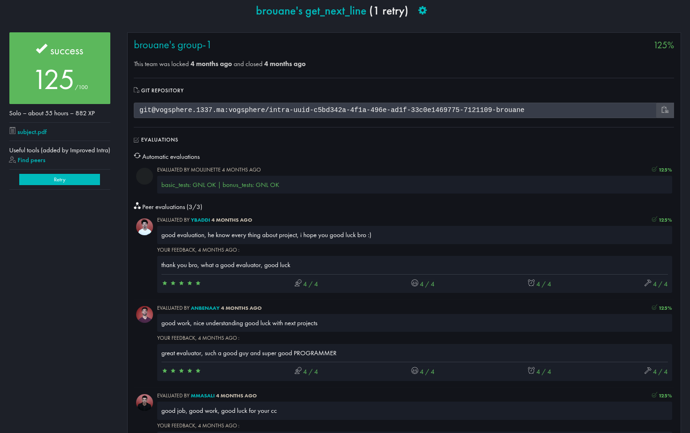

<div align="center">

```
 ██████╗ ███████╗████████╗    ██╗      ███╗   ██╗
██╔════╝ ██╔════╝╚══██╔══╝    ╚██╗     ████╗  ██║
██║  ███╗█████╗     ██║        ╚██╗    ██╔██╗ ██║
██║   ██║██╔══╝     ██║         ╚██╗   ██║╚██╗██║
╚██████╔╝███████╗   ██║          ╚██╗  ██║ ╚████║
 ╚═════╝ ╚══════╝   ╚═╝           ╚═╝  ╚═╝  ╚═══╝

███╗   ██╗███████╗██╗  ██╗████████╗    ██╗      ███╗   ██╗
████╗  ██║██╔════╝╚██╗██╔╝╚══██╔══╝    ╚██╗     ████╗  ██║
██╔██╗ ██║█████╗   ╚███╔╝    ██║        ╚██╗    ██╔██╗ ██║
██║╚██╗██║██╔══╝   ██╔██╗    ██║         ╚██╗   ██║╚██╗██║
██║ ╚████║███████╗██╔╝ ██╗   ██║          ╚██╗  ██║ ╚████║
╚═╝  ╚═══╝╚══════╝╚═╝  ╚═╝   ╚═╝           ╚═╝  ╚═╝  ╚═══╝

██╗     ██╗███╗   ██╗███████╗    ██╗      ███╗   ██╗
██║     ██║████╗  ██║██╔════╝    ╚██╗     ████╗  ██║
██║     ██║██╔██╗ ██║█████╗       ╚██╗    ██╔██╗ ██║
██║     ██║██║╚██╗██║██╔══╝        ╚██╗   ██║╚██╗██║
███████╗██║██║ ╚████║███████╗       ╚██╗  ██║ ╚████║
╚══════╝╚═╝╚═╝  ╚═══╝╚══════╝        ╚═╝  ╚═╝  ╚═══╝
```

*A 42 curriculum project — read any file descriptor one line at a time.*


</div>

---

## ✅ Project grade screenshot




## 📖 What is get_next_line?

**get_next_line** is a 42 curriculum project where you implement a function that reads from a file descriptor and returns one line at a time — including the trailing `\n` when present.

The challenge:
- You can only use `read()`, `malloc()`, and `free()`
- You must handle **any** `BUFFER_SIZE` (1 byte to thousands)
- The function must work correctly across **multiple successive calls**
- State must persist between calls using a **static variable**
- The bonus extends this to handle **multiple file descriptors simultaneously**

This project forces you to truly understand static variables, memory ownership, buffer management, and the subtle edge cases of reading from files, pipes, and stdin.

---

## 🚀 Getting Started

### Compilation

```bash
# Mandatory — single fd
cc -Wall -Wextra -Werror -D BUFFER_SIZE=42 get_next_line.c get_next_line_utils.c -o gnl

# Bonus — multiple fds
cc -Wall -Wextra -Werror -D BUFFER_SIZE=42 get_next_line_bonus.c get_next_line_utils_bonus.c -o gnl_bonus
```

> You can set `BUFFER_SIZE` to any positive integer at compile time. The default is `10`.

### Usage

```c
#include "get_next_line.h"

int fd = open("file.txt", O_RDONLY);
char *line;

while ((line = get_next_line(fd)) != NULL)
{
    printf("%s", line);
    free(line);
}
close(fd);
```

### Bonus — Multiple File Descriptors

```c
char *line_a = get_next_line(fd1);  // reads from fd1
char *line_b = get_next_line(fd2);  // reads from fd2, independent state
char *line_c = get_next_line(fd1);  // continues from fd1 where it left off
```

---

## ⚙️ Behavior

| Input | Return value |
|-------|-------------|
| Line with `\n` | `"...\n"` (newline included) |
| Last line without `\n` | `"..."` (no newline) |
| End of file / empty | `NULL` |
| `fd < 0` | `NULL` |
| `BUFFER_SIZE <= 0` | `NULL` |
| `read()` error | `NULL` |

---

## 📁 Project Structure

```
get_next_line/
│
├── get_next_line.h               # Prototypes, BUFFER_SIZE define
├── get_next_line.c               # Core logic (mandatory)
├── get_next_line_utils.c         # Helper functions (mandatory)
│
├── get_next_line_bonus.h         # Bonus header — adds OPEN_MAX define
├── get_next_line_bonus.c         # Core logic with per-fd static array
└── get_next_line_utils_bonus.c   # Same helpers, bonus header include
```

---

## 🔄 Program Flow

```
get_next_line(fd)
  │
  ├── read_line(working_line, fd)
  │     │
  │     └── loop: read(fd, buffer, BUFFER_SIZE)
  │               ft_strjoin(working_line, buffer)
  │               until '\n' found OR EOF
  │               → returns filled working_line
  │
  ├── next_line(working_line)
  │     │
  │     └── extract from start up to (and including) '\n'
  │         → malloc + copy → returns "line\n" or "last line"
  │
  ├── new_line(working_line)
  │     │
  │     └── trim everything up to and including '\n'
  │         → returns remainder, or NULL if nothing left
  │
  └── return line
```

---

## 🧠 Key Implementation Details

### The Static Variable

The function's memory between calls is a **static pointer** to a "working line" — the accumulated buffer that may contain more than one line's worth of data after a single `read()`.

```
Mandatory:   static char *working_line;
             → one shared state for one fd

Bonus:       static char *working_line[OPEN_MAX];
             → independent state per file descriptor
             → working_line[fd] isolates each fd
```

---

### Read Loop Strategy

`read_line` reads in `BUFFER_SIZE` chunks and keeps joining until a `\n` is found in the working line:

```
BUFFER_SIZE = 5, file = "Hello\nWorld\n"

Read 1: "Hello"  →  working_line = "Hello"       (no \n yet, keep reading)
Read 2: "\nWorl"  →  working_line = "Hello\nWorl" (\n found, stop)

next_line()  →  returns "Hello\n"
new_line()   →  working_line = "Worl"             (saved for next call)

──── next call ────

ft_strchr("Worl") → no \n, read more
Read 3: "d\n"  →  working_line = "World\n"

next_line()  →  returns "World\n"
new_line()   →  working_line = NULL
```

---

### ft_strchr — Newline Sentinel

In this project, `ft_strchr` is repurposed as a **newline detector** that returns `1` if no `\n` is found (meaning we need to keep reading) and `0` if `\n` is present (meaning we can stop).

```c
ft_strchr(NULL)         → 1  (nothing in buffer, must read)
ft_strchr("hello")      → 1  (no newline, keep reading)
ft_strchr("hello\n...") → 0  (newline found, stop reading)
```

---

### ft_strjoin — Ownership Transfer

`ft_strjoin` always **frees `working_line`** before returning the newly joined string. This means the caller doesn't need to track the old pointer — but it also means you must never pass a stack pointer or literal.

```
ft_strjoin(working_line, buffer)
  │
  ├── malloc(strlen(working_line) + strlen(buffer) + 1)
  ├── ft_strjoin_copy(joined, working_line, buffer)
  ├── free(working_line)        ← ownership transferred
  └── return joined             ← caller owns this now
```

---

### new_line — Trimming the Working Buffer

After extracting the current line, `new_line` advances past the `\n` and returns the remainder as a fresh allocation — freeing the old working line in the process.

```
working_line = "Hello\nWorld\nFoo"
                      ↑ skip to here

new_working_line = "World\nFoo"
free(working_line)
return new_working_line
```

If there is nothing after the `\n`, `new_line` returns `NULL` and `working_line` is reset.

---

## 🛠️ Error Handling

| Case | Behavior |
|------|----------|
| `fd < 0` | Returns `NULL` immediately |
| `BUFFER_SIZE <= 0` | Returns `NULL` immediately |
| `malloc` failure | Returns `NULL`, frees partial allocations |
| `read()` returns `-1` | Frees buffer, returns `NULL` |
| Empty working line | Returns `NULL` without crashing |
| Leftover empty string | Freed and reset to `NULL` |

---

## 📊 Mandatory vs Bonus

| Feature | Mandatory | Bonus |
|---------|-----------|-------|
| Read from a single fd | ✅ | ✅ |
| Persistent state between calls | `static char *` | `static char *[OPEN_MAX]` |
| Multiple simultaneous fds | ❌ | ✅ |
| Per-fd independent buffers | ❌ | ✅ (indexed by fd) |

---

## 🔗 Resources

| Resource | Link |
|----------|------|
| 42 Cursus Guide | [get_next_line chapter](https://42-cursus.gitbook.io/guide/2-rank-01/get_next_line) |
| Static variables in C | [cppreference — storage duration](https://en.cppreference.com/w/c/language/storage_duration) |
| read() man page | [man7.org — read(2)](https://man7.org/linux/man-pages/man2/read.2.html) |
| GNL explainer | [Medium — How GNL works](https://medium.com/@ruinadd/42-get-next-line-guide-the-gnl-function-e5eeaab14fc7) |

---

## 📝 Notes on AI Usage

AI tools were used during development for:
- Debugging static variable state leaks across calls
- Understanding edge cases with large and tiny `BUFFER_SIZE` values
- Improving documentation clarity

All algorithm design, logic implementation, and decisions were fully understood and owned by the author.

---

<div align="center">

*Made with static variables and trust issues as part of the 42 curriculum.*

</div>
